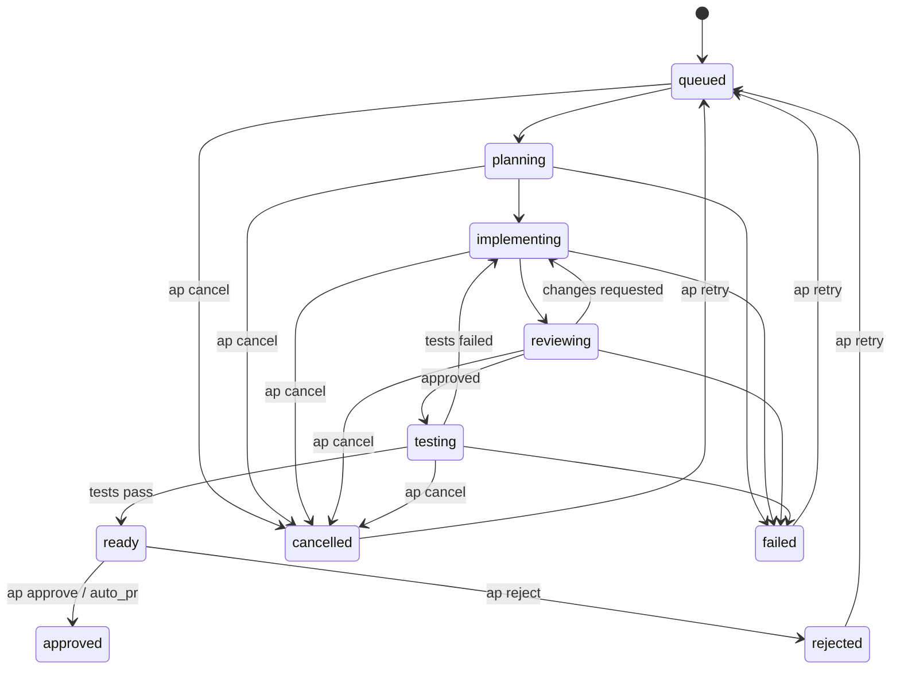

# AutoPR

Autonomous issue-to-PR daemon. AutoPR watches your GitHub, GitLab, and Sentry issues,
then uses an LLM (Claude or Codex CLI) to plan, implement, test, and push fixes — ready
for human approval.

## Install

**macOS:**

```bash
curl -fsSL https://raw.githubusercontent.com/ashwath-ramesh/autopr/master/scripts/install.sh | bash
```

Upgrade later from CLI:

```bash
ap upgrade
ap upgrade --check
```

**From source (any platform with Go 1.23+):**

```bash
go build -o ap ./cmd/autopr && mv ap /usr/local/bin/
```

## Quick Start

### 1. Install an LLM CLI

AutoPR shells out to an LLM CLI tool. Pick one and install it:

```bash
# Option A: OpenAI Codex CLI (needs OPENAI_API_KEY)
npm install -g @openai/codex

# Option B: Anthropic Claude Code CLI (needs ANTHROPIC_API_KEY)
npm install -g @anthropic-ai/claude-code
```

### 2. Set up AutoPR

```bash
ap init                    # creates ~/.config/autopr/ with config + credentials
ap config                  # opens config in $EDITOR — add your projects
```

### 3. Start the daemon

```bash
ap start                   # background daemon
ap start -f                # foreground (for debugging)
```

### 4. Watch it work

```bash
ap tui                     # interactive dashboard
ap list                    # list all jobs
ap issues                  # list synced issues + eligibility
ap logs <job-id>           # view LLM output for a job
ap approve <job-id>        # approve and create PR
```

### What happens

1. AutoPR polls GitHub/Sentry (or receives GitLab webhooks) for new issues
2. For each issue: **Plan** → **Implement** → **Code Review** → **Test** → **Ready**
3. You review the result with `ap tui` or `ap logs`, then `ap approve` or `ap reject`
4. On approve, a PR is created. Set `auto_pr = true` to skip manual approval.

## Prerequisites

### LLM CLI Tool

AutoPR does not call LLM APIs directly. It shells out to a CLI in
non-interactive mode and parses the output. You need one installed and authenticated:

| Provider | Install | Auth |
|----------|---------|------|
| OpenAI Codex | `npm install -g @openai/codex` | `OPENAI_API_KEY` env var |
| Anthropic Claude | `npm install -g @anthropic-ai/claude-code` | `ANTHROPIC_API_KEY` env var |

Configure in `config.toml`:

```toml
[llm]
provider = "codex"   # or "claude"
```

### Source Tokens

| Source | Token type | Scopes |
|--------|-----------|--------|
| GitHub | Fine-grained PAT | `Contents: Read and write`, `Issues: Read-only` |
| GitLab | Project access token | `api` |
| Sentry | Auth token | `event:read`, `project:read` |

Set via `ap init` or env vars (`GITHUB_TOKEN`, `GITLAB_TOKEN`, `SENTRY_TOKEN`).

## Configuration

AutoPR uses `~/.config/autopr/config.toml`. Running `ap init` creates it interactively.

```toml
log_level = "info"         # debug, info, warn, error

[daemon]
webhook_port = 9847
max_workers = 3
max_iterations = 3         # implement<->review retries
sync_interval = "5m"       # GitHub/Sentry polling interval
# auto_pr = false          # set true to auto-create PRs after tests pass

[llm]
provider = "codex"         # codex or claude

[[projects]]
name = "my-project"
repo_url = "git@github.com:org/repo.git"
test_cmd = "go test ./..."
base_branch = "main"

  [projects.github]
  owner = "org"
  repo = "repo"
  # include_labels = ["autopr"] # optional: ANY match; empty means all open issues
```

### File Locations

AutoPR follows the [XDG Base Directory Specification](https://specifications.freedesktop.org/basedir-spec/latest/):

| Directory | Default | Contents |
|-----------|---------|----------|
| Config | `~/.config/autopr/` | `config.toml`, `credentials.toml` |
| Data | `~/.local/share/autopr/` | `autopr.db`, `repos/` |
| State | `~/.local/state/autopr/` | `autopr.log`, `autopr.pid`, `version-check.json` |

Override with `XDG_CONFIG_HOME`, `XDG_DATA_HOME`, or `XDG_STATE_HOME`. Run `ap paths` to see resolved locations.

You can also set explicit paths in config:

```toml
db_path = "/custom/path/autopr.db"
repos_root = "/custom/path/repos"
log_file = "/custom/path/autopr.log"
```

### Environment Variable Overrides

| Env Var | Overrides |
|---------|-----------|
| `GITLAB_TOKEN` | `[tokens] gitlab` |
| `GITHUB_TOKEN` | `[tokens] github` |
| `SENTRY_TOKEN` | `[tokens] sentry` |
| `AUTOPR_WEBHOOK_SECRET` | `[daemon] webhook_secret` |

> **Note:** `GITHUB_TOKEN` requires a fine-grained PAT with `Contents: Read and write` + `Issues: Read-only`
> scoped to the target repo. With read-only contents access, the daemon will work end-to-end but
> branch push will fail — you'll need to push branches manually after approving jobs.

## Setting Up a Project

### GitHub (polling)

1. Add `[projects.github]` with `owner` and `repo`.
2. Optional gating: set `include_labels = ["autopr"]` to only create jobs for matching issues.
3. Matching is case-insensitive and uses ANY configured label.
4. Empty `include_labels` keeps current behavior (all open issues are eligible).
5. AutoPR polls for open issues every `sync_interval`.
6. New eligible issues are picked up and processed automatically.

### GitLab (webhook-driven)

1. Add a `[[projects]]` block with `[projects.gitlab]` containing your `project_id`.
2. In GitLab, go to **Settings > Webhooks** and add:
   - **URL:** `http://<your-host>:9847/webhook`
   - **Secret token:** same value as `AUTOPR_WEBHOOK_SECRET`
   - **Trigger:** Issue events
3. When an issue is opened or reopened, AutoPR creates a job automatically.

### Sentry (polling)

1. Add `[projects.sentry]` with `org` and `project`.
2. AutoPR polls for unresolved issues every `sync_interval`.

## CLI Commands

| Command | Description |
|---------|-------------|
| `ap init` | Interactive setup wizard |
| `ap start [-f]` | Start the daemon (`-f` for foreground) |
| `ap upgrade [--check]` | Check for and install the latest `ap` release |
| `ap stop` | Gracefully stop the daemon |
| `ap status` | Show daemon status and job counts |
| `ap list [--project X] [--state Y]` | List jobs with optional filters |
| `ap issues [--project X] [--eligible|--ineligible]` | List synced issues and eligibility |
| `ap logs <job-id>` | Show LLM output, artifacts, and tokens |
| `ap approve <job-id>` | Approve a job and create PR |
| `ap reject <job-id> [-r reason]` | Reject a job |
| `ap cancel <job-id> \| --all` | Cancel a queued/running job (or all) |
| `ap retry <job-id> [-n notes]` | Re-queue a failed/rejected/cancelled job |
| `ap config` | Open config in `$EDITOR` |
| `ap paths` | Show where files are stored |
| `ap tui` | Interactive terminal dashboard |

All commands accept `--json` for machine-readable output and `-v` for debug logging.
`ap start` checks for new releases at most once every 24h and prints a non-blocking upgrade notice when available.

### Job ID Prefix Matching

`ap list` shows an 8-character short job ID (e.g. `2dad8b6b`). All action commands
accept a prefix of any length — just enough to be unambiguous:

```bash
ap logs 2dad          # matches ap-job-2dad8b6b...
ap approve 2d         # works if only one job starts with "2d"
ap reject 2dad8b6b    # full short ID also works
```

For automation, use `ap list --json` which returns full job IDs.

## TUI Dashboard

`ap tui` launches an interactive terminal UI with keyboard navigation.

**Level 1 — Job List:** Dashboard header showing daemon status, sync interval,
worker count, job state counters, and synced issue summary (`Issues: X synced, Y eligible, Z skipped`).
Job table shows short job ID, state, project, issue source (e.g. GitHub #1), iteration progress,
and truncated issue title.

**Level 2 — Job Detail:** Full job metadata plus a pipeline session table showing each step
(plan, implement, code_review) with status, token usage, and duration. Press `d` to view the
git diff of changes.

**Level 3 — Session Detail:** Full LLM output rendered as styled markdown with syntax-highlighted
code blocks (via glamour). Press `tab` to toggle between the input prompt and output response.

Auto-refresh runs every 5 seconds in job list and job detail views. Auto-refresh pauses in
session detail and diff views to avoid content jumping.

| Key | Action |
|-----|--------|
| `j/k` | Navigate up/down |
| `enter` | Drill into selected item |
| `esc` | Go back one level |
| `tab` | Toggle input/output (session view) |
| `d` | View git diff (job detail) |
| `c` | Cancel selected/current job (list/detail) |
| `u/d` | Half-page scroll (session/diff view) |
| `r` | Refresh immediately |
| `q` | Quit |

## Job States



## Custom Prompts

Override default LLM prompts per project with custom markdown files:

```toml
[projects.prompts]
plan = "/path/to/plan.md"
implement = "/path/to/implement.md"
code_review = "/path/to/code_review.md"
```

Prompt templates support these placeholders:

| Placeholder | Value |
|-------------|-------|
| `{{title}}` | Issue title |
| `{{body}}` | Issue body (sanitized) |
| `{{plan}}` | Plan artifact content |
| `{{review_feedback}}` | Previous review + test output |

## Health Check

The daemon exposes a health endpoint on the webhook port:

```bash
curl http://localhost:9847/health
```

Returns JSON with `status`, `uptime_seconds`, and `job_queue_depth`.

## Architecture

```
cmd/autopr/            CLI (cobra)
internal/
  config/              TOML config loader with env overrides
  daemon/              Daemon lifecycle, PID file, signal handling
  db/                  SQLite store (WAL mode, reader/writer pools)
  git/                 Clone, branch, worktree, push operations
  issuesync/           GitHub + Sentry polling sync loop
  llm/                 CLI provider interface (claude, codex)
  pipeline/            Plan → implement → review → test orchestration
  tui/                 Bubbletea interactive dashboard
  webhook/             GitLab webhook handler
  worker/              Concurrent job processing pool
```

## Development

```bash
go build ./...
go vet ./...
go test ./...
```

## Resetting

```bash
# Reset database only
rm -f ~/.local/share/autopr/autopr.db
ap init

# Full clean slate
rm -rf ~/.config/autopr ~/.local/share/autopr ~/.local/state/autopr
ap init
```
